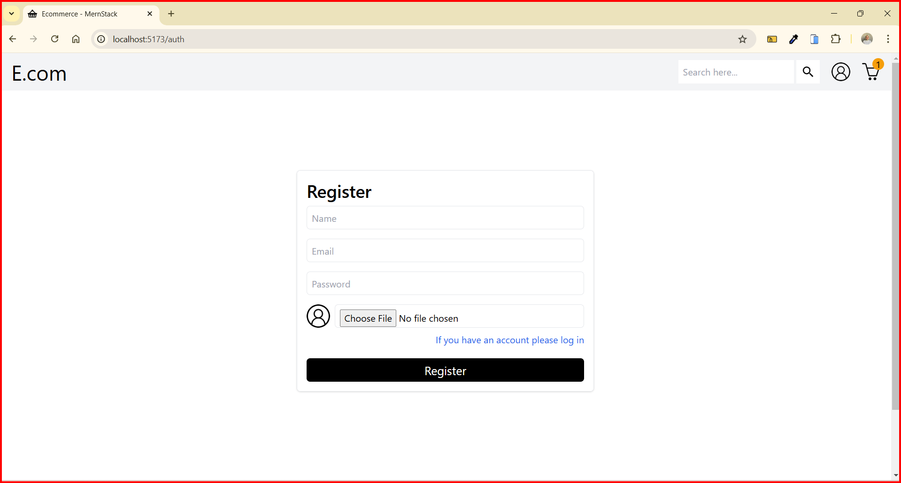
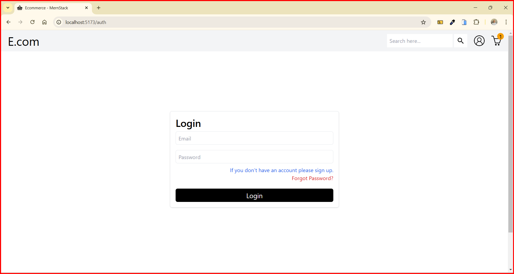
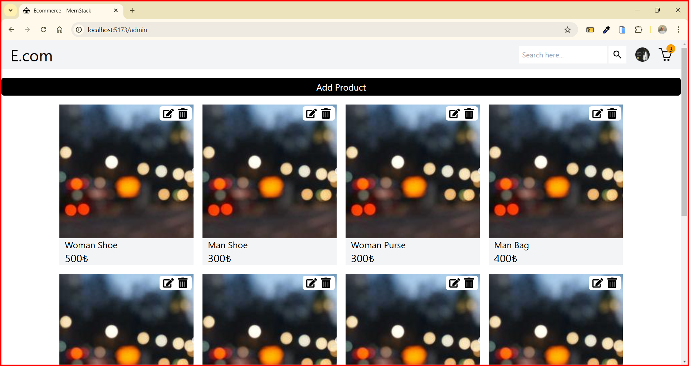
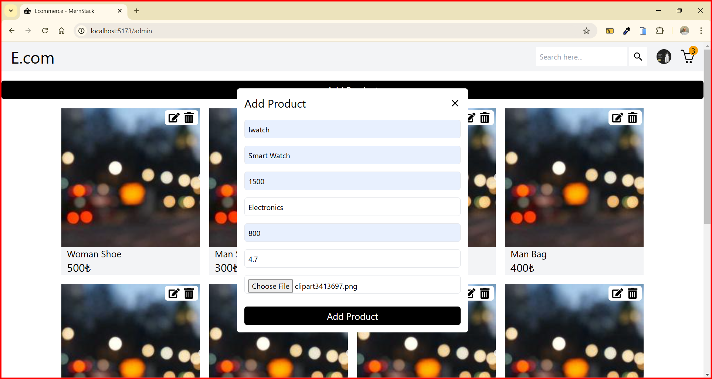
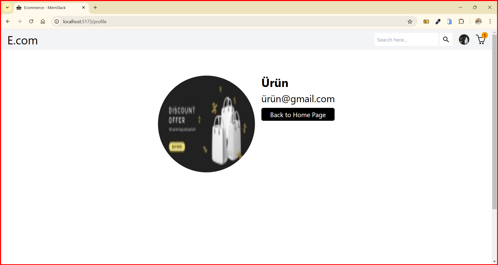
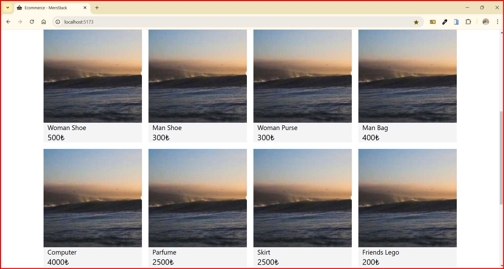
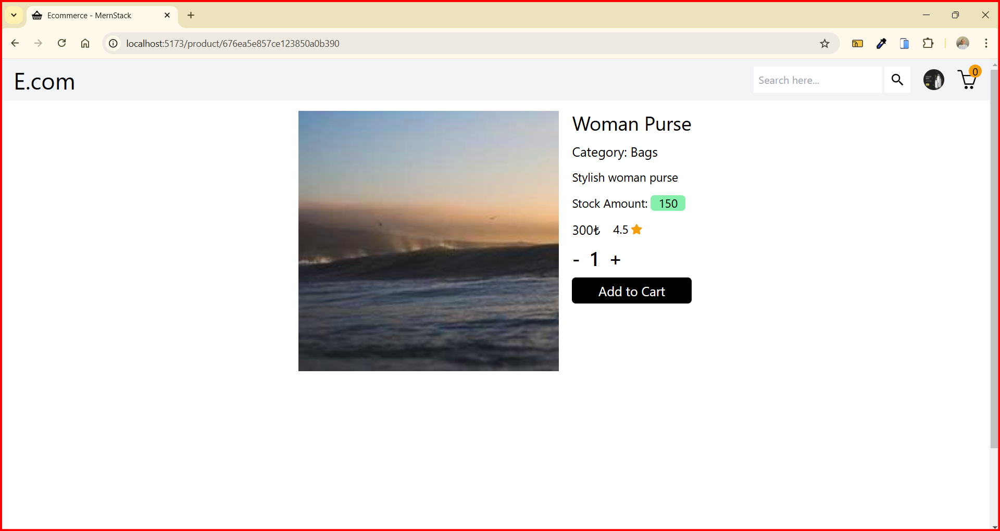
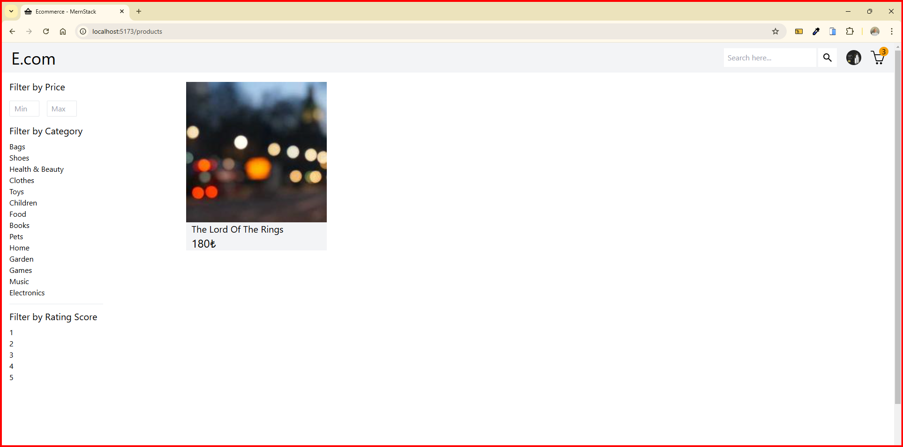
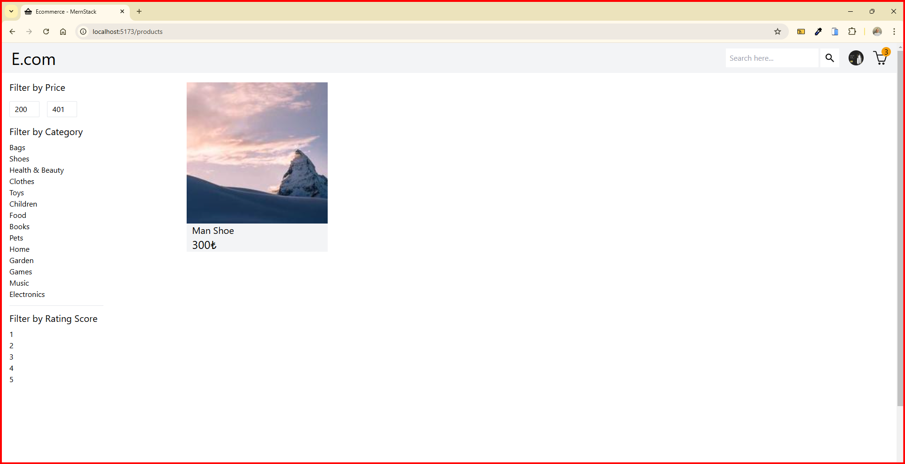
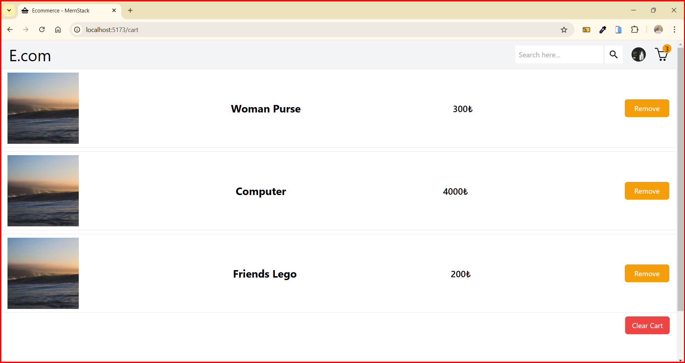

<h1>Ecommerce App - MERN Stack</h1>

This project is a MERN Stack E-Commerce application developed with modern web technologies that meets all the functionality of a real e-commerce application. The application includes user and administrator (admin) panels and offers different authorization features according to user roles. It provides a structure where users can examine and purchase products, while administrators can manage products. Admins and users have different access levels and visual experiences. All endpoints in the backend work integrated with the front end. It has fast data access with user-friendly search and filtering mechanisms. The Redux Toolkit has efficient state management and minimal API calls. User data is encrypted with bcryptjs, authorized with JWT, and security measures are taken with CORS. Fast loading and management of product images are provided with Cloudinary integration.

<h1>Backend Technical Details:</h1>

<h2>Technologies and Packages Used:</h2>

Express.js: Used to create a fast and scalable backend infrastructure for the application.

Mongoose: Provides easy data model creation with the MongoDB database.

JWT (JsonWebToken): Used to securely manage user sessions.

BcryptJS: Increases security by hashing user passwords.

Multer: Used to upload image files to the server.

Cloudinary: Used for secure storage and management of product images.

Nodemailer: Provides email verification and notification processes for users.

CORS: Used to provide secure communication between the front end and the back end.

Dotenv: Used for management of environmental variables.

<h1>Backend Features:</h1>

<h2>Technologies and Packages Used:</h2>

Authentication and Authorization: User login and registration processes were securely provided with JWT. Authorization was made according to roles (admin and user separation).

CRUD Operations: Admins can add, delete, and update products.

RESTful API: API endpoints that comply with standards were created for all operations such as product, category, and user management.

Cart Management: Adding, removing, and editing users' products to the cart was done dynamically.

<h1>Frontend  Technical Details:</h1>

React: Modern and component-based frontend development.

Redux Toolkit: Used for global state management.

React-Router-Dom: Used for transitions between pages.

React-Paginate: The pagination function was provided in the product listing.

React-Slick & Slick-Carousel: Modern and user-friendly slider components were created for product images.

React-Toastify: Notifications were created for feedback after user actions.

Tailwind CSS: Used for a fast and modern design.

<h1>Frontend Features:</h1>

Dynamic Page Transitions: Different content is shown according to the user's role.

Admin Panel: Has the authority to add, delete, update, and list products.

User Panel: Can examine products, add and remove them from the cart, and manage orders.

Product Listing and Search: Users can search and filter products by name, category, price, and rating.

Cart Management:

Users can add products to the cart, increase or decrease the quantity, and empty the cart.

Responsive Design: The application works perfectly on all device sizes.

<h2>Register</h2>

<h2>Login</h2>

<h2>Admin Panel</h2>

<h2>Admin CRUD Operations</h2>

<h2>Admin Profile</h2>

<h2>Home Page</h2>

<h2>Products</h2>

<h2>Products Detail</h2>

<h2>Products Filter</h2>

<h2>Cart</h2>

